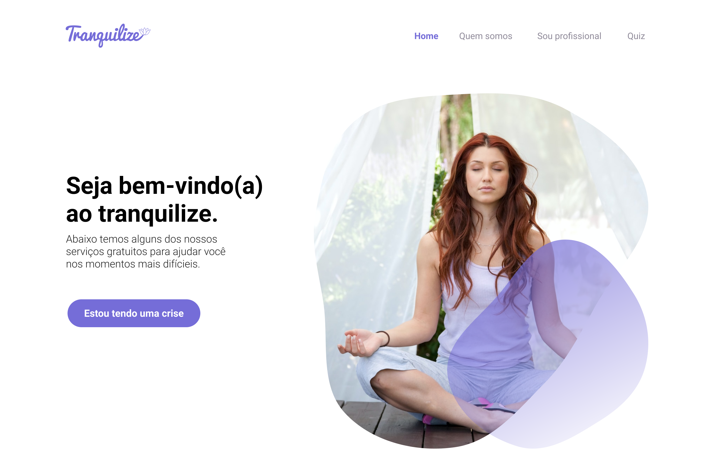

<h1 align="center"> Tranquilize </h1>

Tranquilize é uma plataforma de ajuda a pessoas com ansiedades.  

  <a href="#-tecnologias">Tecnologias</a>&nbsp;&nbsp;&nbsp;|&nbsp;&nbsp;&nbsp;
  <a href="#-projeto">Projeto</a>&nbsp;&nbsp;&nbsp;|&nbsp;&nbsp;&nbsp;

  

## 🚀 Tecnologias

Esse projeto foi desenvolvido com as seguintes tecnologias:

- HTML e CSS
- JavaScript
- Git e Github
- Figma

## 💻 Projeto

O Tranquilize é uma plataforma onde o intúito é ajudar pessoas com crises de ansiedade, onde contem exercícios de auto-ajuda e consultas online com psicólogos.

- Visite o projeto online (https://github.com/joaovitorbarboz/Tranquilize)
